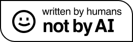

# token by token

**token by token** is a technical blog where we post weekly about topics we learn. All posts discuss ML/AI topics. 

> *If you can't explain something to a first year student, then you haven't really understood .*

We decided to start this project to encourage each other to learn and dive deep into topics in the ML field. By publishing our work, we are held accountable to potential readers to present concepts in a format and language of high quality and one that could be easily understood by other learners. It is called ***[token by token](https://token-by-token.com )*** because we hope to break down and present the information in bits that are digestible, similar to the way we, the writers, learned them.

We believe that the best way to learn is to teach, and that we only understand things if we can simplify them and explain them. 

PS: All posts are written entirely by us, humans. No AI is used in the posts we publish. 

---

You can read our posts on our website: https://token-by-token.com 
